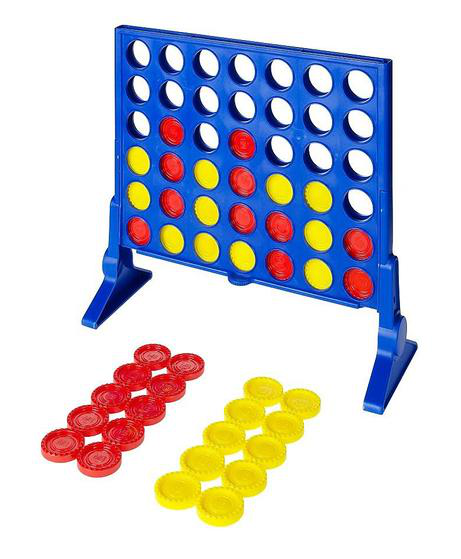

# Quatre en ratlla

Aquesta pàgina descriu **Quatre en ratlla**, la pràctica de Haskell que
substitueix l'examen parcial de LP durant l'Era del Confinament.

## Presentació

Es demana que feu un programa en Haskell que permeti jugar a un humà al
quatre en ratlla contra diferentes estratègies de l'ordinador.

El joc del quatre en ratlla es juga en un tauler `n` × `m`, on `n` i `m` es
defineixen al iniciar la partida. El cas més habitual és el 6 × 7, és a dir, 6
files i 7 columnes. Cada jugador té `n`×`m` fitxes d'un mateix color. Per
exemple, unes son vermelles i les altres grogues. Els jugadors introdueixen
alternativament una fitxa del seu color en una columna. La fitxa cau fins
dipositar-se al d'amunt de l'última fitxa que s'ha introduït en la mateixa
columna. Un jugador guanya quan després d'introduir una fitxa hi ha 4 fitxes
consecutives del seu color formant una línia horitzontal, vertical o diagonal.
La partida acaba quan un jugador guanya o s'omple el tauler.

## Estratègies

Una estratègia és un algorisme que segueix l'ordinador per intentar guanyar el
joc. Més concretament, en aquesta pràctica, una estratègia és una funció que rep
el tauler i el jugador a qui toca moure i retorna la columna on posar la seva
fitxa. Heu de fer que les funcions del joc siguin parametritzades amb
l'estratègia escollida.

Cal que programeu tres estratègies:

- estratègia `random`: cada tirada de l'ordinador és una columna a l'atzar.

- estratègia `greedy`: cada tirada de l'ordinador és a la columna que li
permet posar en ratlla el nombre més alt de fitxes pròpies. En cas
d'empat, tria a l'atzar.

- estratègia `smart`: trieu vosaltres una estratègia el més astuta possible.
Es valorarà la qualitat d'aquesta estratègia.

## Lliurament

Només heu de lliurar un fitxer ZIP que, al descomprimir-se,
generi els fitxers següents:

- `joc.hs`: el codi del vostre programa,
- `README.md`: la documentació de la vostra pràctica,
- `*.png` si cal adjuntar imatges a la documentació.

Res més. Sense directoris ni subdirectoris.

El codi s'ha de poder compilar i generar un executable amb la comanda
`ghc joc.hs`. Totes les funcions i tipus han d'estar
documentades en el propi codi amb comentaris adients.

El projecte ha de contenir un fitxer `README.md` que el documenti
adequadament. Vegeu, per
exemple, https://gist.github.com/PurpleBooth/109311bb0361f32d87a2. Si us calen
imatges al `README.md`, deseu-los com a fitxers PNG.

El lliurament s'ha de fer a través del Racó, abans del **diumenge 26 d'abril a les
23:59**.

## Observacions

L'enunciat deixa obertes moltes qüestions intencionadament (qui comença, estratègia
astuta, entrada/sortida, ...). Sou els responsables de prendre les vostres
pròpies decisions i deixar-les reflectides adientment al codi i a la
documentació. Ara bé, fixeu-vos que és imperatiu que les funcions del joc siguin
funcions d'ordre superior que reben l'estratègia com a paràmetre.

Per evitar problemes de còpies, no pengeu el vostre projecte en repositoris
públics. Si us cal un repositori GIT, useu [GITLAB
FIB](https://gitlab.fib.upc.edu/users/sign_in).

> Falta explicar com fer randoms.
